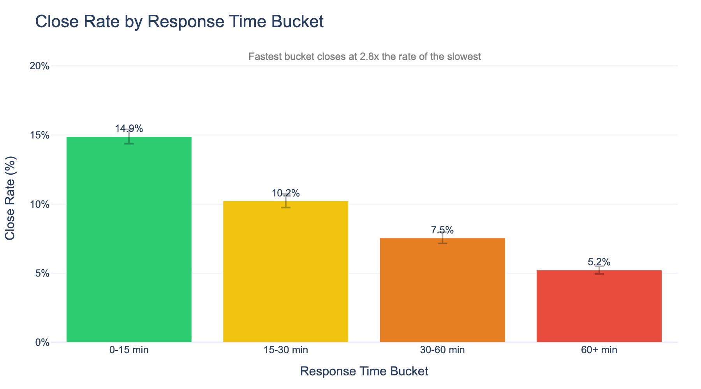
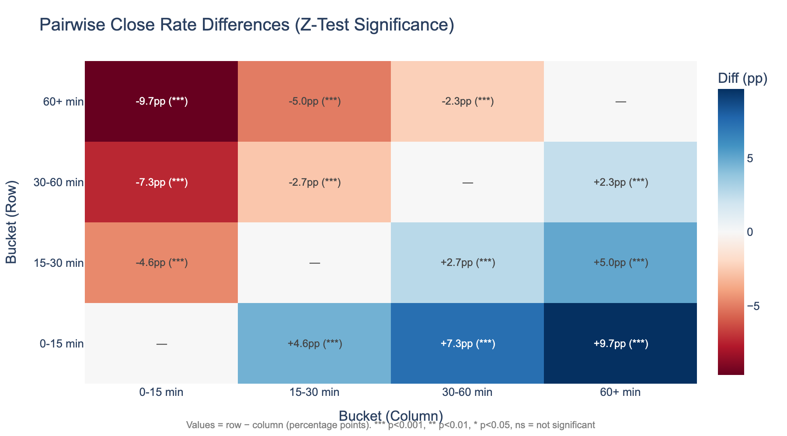
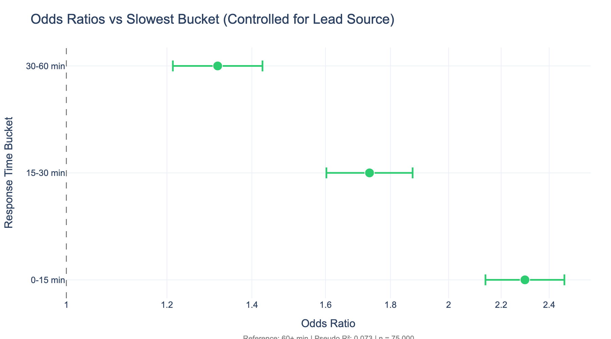
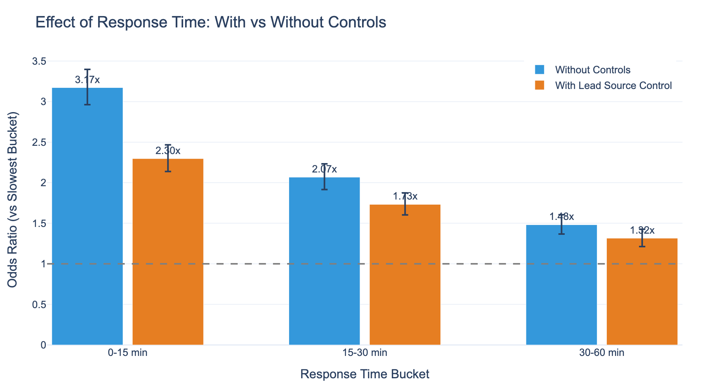
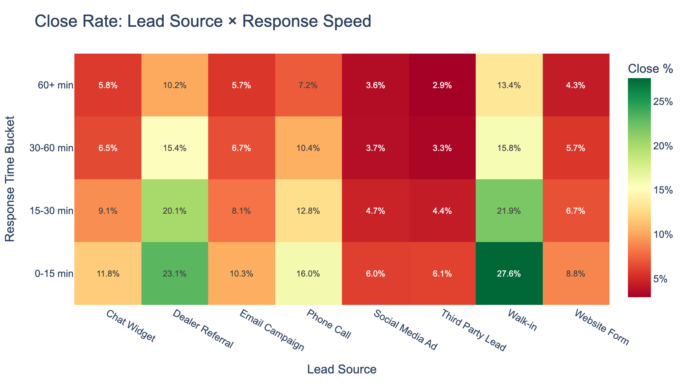
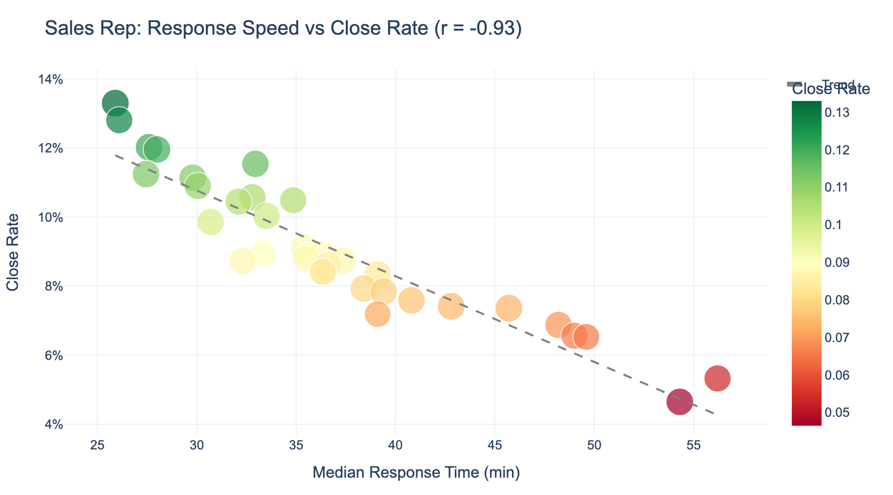
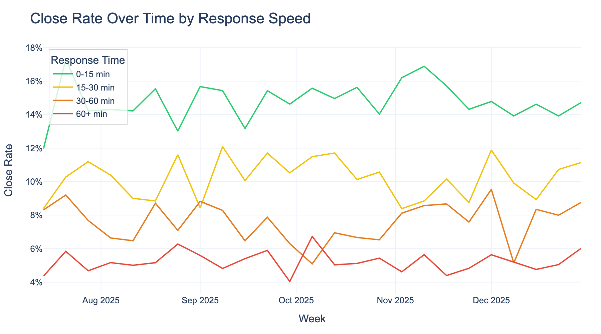
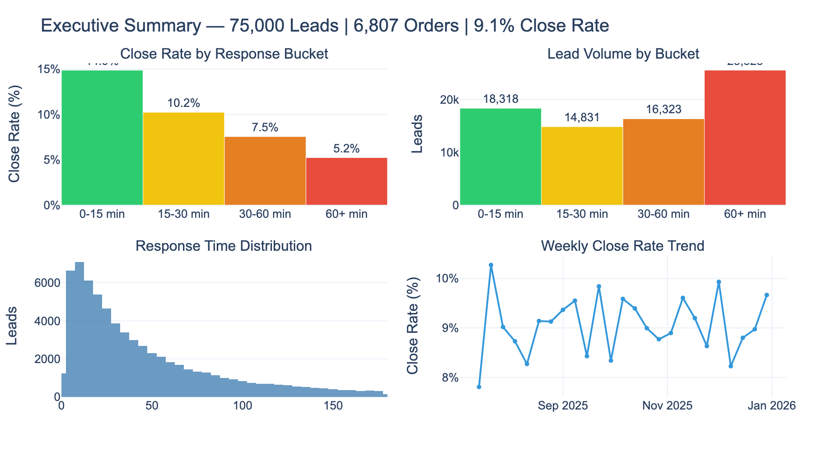

# Lead Response Time Analyzer

## The Problem

Every sales organization eventually confronts the same question: **does responding faster to leads actually increase the probability of closing a deal?**

The question sounds simple. It is not. And the reason it is not simple is the reason most organizations get the answer wrong.

Here is what typically happens. Someone pulls the data. They compare close rates for leads that got fast responses versus slow responses. They find a difference. They present it to leadership. Decisions get made. Resources get allocated.

The problem is that this naive comparison is almost certainly misleading, and the direction of the error is unknowable without rigorous analysis.

### Why naive analysis fails

Consider what happens when a walk-in lead arrives versus a third-party internet lead. The walk-in is physically present — a salesperson responds immediately, and the lead already has high purchase intent. The internet lead arrives at 2 AM, gets responded to the next morning, and was casually browsing. The walk-in closes at 22%. The internet lead closes at 4%.

If you simply compare "fast response" versus "slow response" close rates, you are not measuring the effect of speed. You are measuring the fact that high-intent leads happen to get fast responses. This is **confounding** — the most common and most dangerous error in observational data analysis.

The same problem exists at the rep level. Your best salespeople are often both the fastest responders *and* the highest closers. Is their success driven by speed, or by skill? Without controls, you cannot distinguish the two.

**This tool exists to solve that problem systematically.**

## The Solution: A Five-Layer Analysis System

The analysis is structured as a progression of increasingly rigorous questions. Each layer addresses a specific weakness of the previous layer. No single test is sufficient — it is the *system* of tests, applied in sequence, that produces reliable conclusions.

### Layer 1: Establish the Pattern

Before testing anything, we must see the raw data clearly.

The first layer groups leads into response time buckets (0-15 min, 15-30 min, 30-60 min, 60+ min) and calculates close rates for each, with 95% confidence intervals using Wilson score intervals.



This chart answers the most basic question: *is there a visible pattern?* In the enterprise dataset above (75,000 leads, 24 weeks), leads responded to within 15 minutes close at 14.9%, while leads waiting over an hour close at 5.2% — a 2.8x difference.

But a visible pattern is necessary, not sufficient. The pattern could be noise. It could be confounding. We need to know which.

### Layer 2: Test Whether the Pattern Is Real

A pattern in data can arise from two sources: a genuine association, or random chance. The chi-square test of independence distinguishes between these.

$$\chi^2 = \sum \frac{(O - E)^2}{E}$$

The test constructs a hypothetical world where response time and close rate are completely unrelated, calculates what the data *would* look like in that world, and measures how far our actual data deviates from it. If the deviation is large enough — quantified by the p-value — we reject the hypothesis of no association.

But "the pattern is real" is imprecise. We need to know *where* the differences are and *how large* they are. The pairwise z-tests compare every bucket against every other:



Every pairwise comparison in the enterprise dataset is significant at p < 0.001. The fastest bucket closes 9.7 percentage points higher than the slowest. This is not a subtle effect.

### Layer 3: Control for Confounding

This is where most analyses stop, and where most analyses go wrong.

The raw close rate differences mix together three distinct effects:

1. **The true effect of response speed** (what we want to measure)
2. **The effect of lead source** (walk-ins close higher AND get faster responses)
3. **The effect of rep skill** (better reps respond faster AND close more)

Logistic regression separates these. The model estimates the effect of response time *after mathematically holding lead source constant*:

$$\log\left(\frac{p}{1-p}\right) = \beta_0 + \beta_1 \cdot \text{bucket} + \beta_2 \cdot \text{source}$$

The output is expressed as odds ratios — how many times more likely a lead in each bucket is to close compared to the slowest bucket, with confounders neutralized:



After controlling for lead source, the fastest bucket still has 2.3x the odds of closing compared to the slowest. The effect shrinks from the raw 2.8x — confirming that some confounding exists — but remains highly significant.

The model comparison makes this explicit:



The blue bars show the raw (uncontrolled) effect. The orange bars show the effect after accounting for lead source. The effect shrinks but persists across every bucket. This is the critical finding: **response time has an independent, statistically significant association with close rate that is not explained by lead source differences.**

### Layer 4: Assess the Confounding Structure

Understanding *how much* confounding exists — and where it comes from — is as important as the final answer.

The heatmap reveals how close rates vary across both dimensions simultaneously:



Two things are visible here. First, the response time gradient (left-to-right darkening) exists *within every single lead source*. Walk-ins responded to in under 15 minutes close at 27.6%; walk-ins waiting over an hour close at 13.4%. The same pattern holds for website forms, phone calls, and every other source. This consistency across sources is strong evidence that the effect is not a confounding artifact.

Second, the rep-level scatter plot reveals the confounding mechanism directly:



The correlation between rep response speed and close rate is r = -0.93 — nearly perfect. Faster reps close more. This is exactly the confounding structure that makes naive analysis dangerous. Without controls, you cannot tell whether speed causes success or whether skilled people simply do both.

### Layer 5: Verify Consistency Over Time

A real effect should be stable. An artifact of a single unusual week should not drive strategic decisions.



Across 24 weeks, the fastest-response bucket consistently outperforms the slowest. The gap is not driven by a single anomalous period. The ordering of buckets is maintained week after week. This temporal consistency is additional evidence that the pattern reflects a durable association rather than a statistical accident.

### The Complete Picture



75,000 leads. 6,807 orders. 35 sales reps. 8 lead sources. 24 weeks. Every statistical test points in the same direction: leads that receive faster responses close at significantly higher rates, and this association persists after controlling for lead source, holds within every lead source independently, and is stable across time.

## What This Tool Does Not Claim

Intellectual honesty requires stating the boundaries of what this analysis can establish:

1. **This is an association, not a proven causal relationship.** Observational data cannot prove causation. There may be unmeasured confounders we cannot control for. The only way to establish causation definitively would be to randomly assign response delays — an experiment no ethical organization would run.

2. **We can only control for what we measure.** The regression controls for lead source. If there are other confounders (lead quality scores, time of day, market conditions) that we do not have in the data, they remain uncontrolled.

3. **Selection bias exists.** This analysis only includes leads that received a response. Leads that were never contacted are excluded entirely.

4. **Results may not generalize.** The patterns in your data reflect your organization, your market, and your time period. They are not universal laws.

These are not weaknesses of this tool. They are properties of observational data analysis itself. The tool makes these limitations explicit rather than hiding them — because understanding what you *don't* know is as important as understanding what you do.

## Getting Started

### Prerequisites

- Python 3.8+
- pip

### Installation

```bash
git clone https://github.com/iNoahCodeGuy/response_time_cl_analysis.git
cd response_time_cl_analysis

python -m venv venv
source venv/bin/activate  # Windows: venv\Scripts\activate

pip install -r requirements.txt
streamlit run app.py
```

The app opens at `http://localhost:8501`. Click **"Load Sample Data"** to explore with a pre-built enterprise dataset (75,000 leads).

### Generate Figures

```bash
python generate_enterprise_sample.py  # Creates 75K-lead dataset
python generate_figures.py            # Produces all analytical figures
```

### Your Data

Upload a CSV or Excel file with these columns (names are auto-detected):

| Data | Example Column Names | Required |
|------|---------------------|----------|
| Lead arrival time | `created_at`, `lead_time`, `timestamp` | Yes |
| First response time | `first_response`, `replied_at`, `contacted_at` | Yes |
| Order outcome | `ordered`, `sold`, `converted`, `closed_won` | Yes |
| Lead source | `source`, `channel`, `lead_source` | No (but recommended) |
| Sales rep | `rep`, `agent`, `salesperson` | No (but recommended) |

Supported formats: CSV, XLSX, XLS. Date formats: ISO, US, European, Excel serial. Outcome values: Boolean, 1/0, Yes/No, or text.

## Architecture

The system is organized by function, not by file type:

```
response_time_cl_analysis/
├── app.py                      # Entry point
├── config/settings.py          # All configurable parameters
│
├── data/                       # Input handling
│   ├── loader.py               # File ingestion and validation
│   ├── datetime_parser.py      # Automatic date format detection
│   ├── column_mapper.py        # Auto-detection of column roles
│   ├── sample_generator.py     # Realistic sample data with embedded confounding
│   └── export.py               # Results export for independent verification
│
├── analysis/                   # Statistical engine
│   ├── preprocessing.py        # Response time calculation and bucketing
│   ├── descriptive.py          # Close rates, CIs, cross-tabulations
│   ├── statistical_tests.py    # Chi-square, z-tests, effect sizes
│   ├── regression.py           # Logistic regression with confounding controls
│   └── weekly_trends.py        # Temporal consistency analysis
│
├── explanations/               # First-principles explanation system
│   ├── explainers.py           # Statistical concept explanations
│   ├── common.py               # Step bridges and narrative flow
│   ├── templates.py            # Explanation templates
│   ├── formulas.py             # LaTeX notation
│   ├── verification_panels.py  # Show-your-work calculation panels
│   ├── p_value.py              # P-value interpretation
│   ├── odds_ratio.py           # Odds ratio interpretation
│   └── confidence_intervals.py # CI interpretation
│
├── components/                 # Interface layer
│   ├── results_dashboard.py    # Main results display
│   ├── charts.py               # Plotly visualizations
│   ├── upload.py               # File upload
│   ├── mapping_ui.py           # Column mapping
│   ├── step_display.py         # Step-by-step walkthrough
│   └── settings_panel.py       # Configuration sidebar
│
└── figures/                    # Generated analytical figures
```

## Customization

Response time buckets and significance thresholds are configurable in `config/settings.py`:

```python
# Bucket boundaries (minutes)
DEFAULT_BUCKETS = [0, 15, 30, 60, float('inf')]

# Significance level
DEFAULT_ALPHA = 0.05  # Change to 0.01 for stricter threshold
```

Three presets are available: **Standard** (0/15/30/60+), **Aggressive** (0/5/15/30+ for high-volume teams), and **Relaxed** (0/30/60/120+ for complex B2B cycles).

## Built With

[Streamlit](https://streamlit.io/) | [Pandas](https://pandas.pydata.org/) | [Plotly](https://plotly.com/) | [Statsmodels](https://www.statsmodels.org/) | [SciPy](https://scipy.org/)
